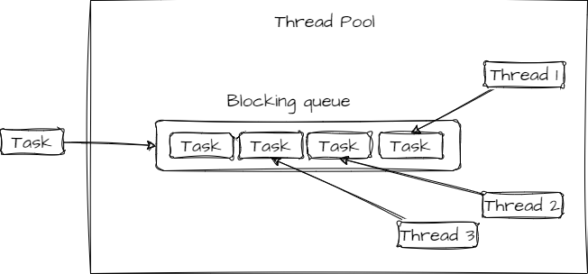

If we need to execute some tasks concurrently we can either create one thread per task
or we can execute the task to some pre-created threads.

By using a Threadpool we can control at max how many threads will
be created at a time.

This helps in controlling the resource usage.

Whenever a thread is available it takes a task from queue and executes it.
